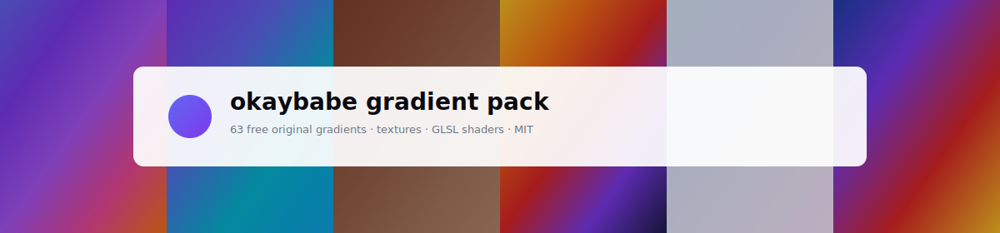
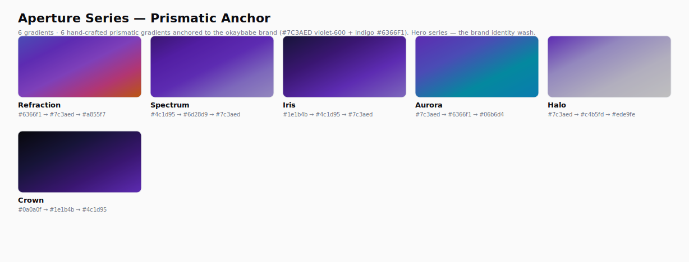
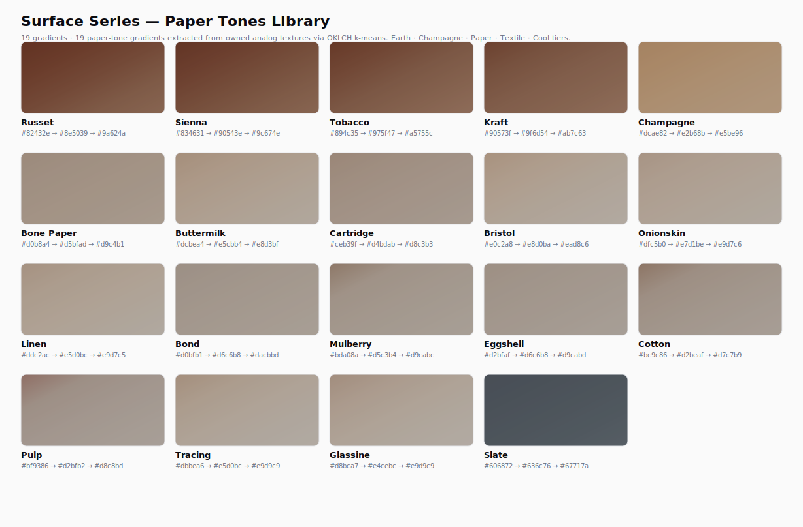
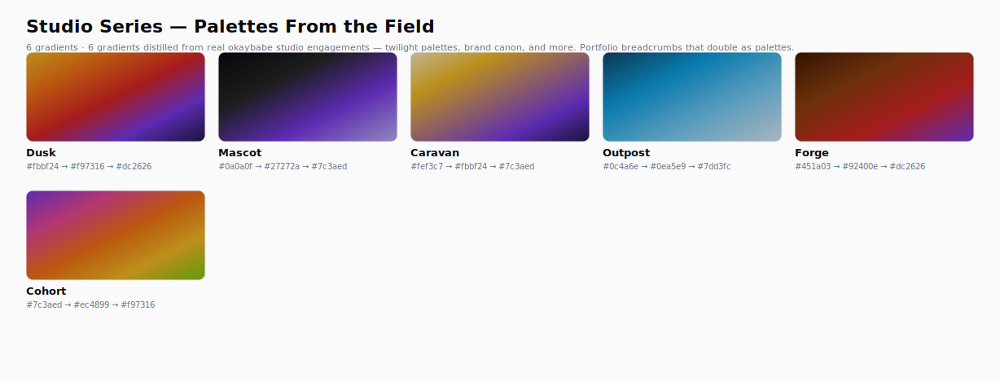
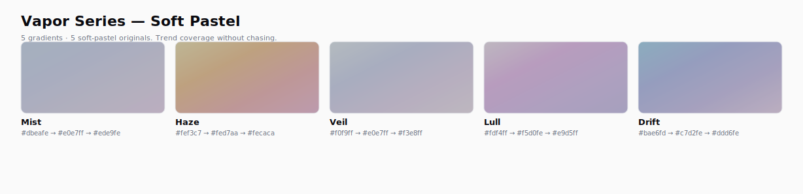
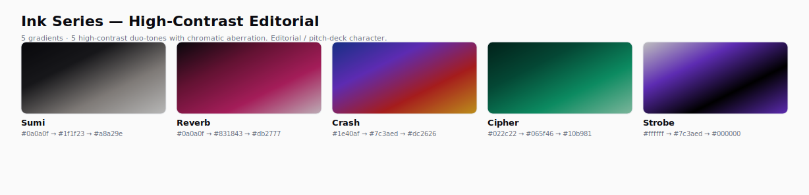
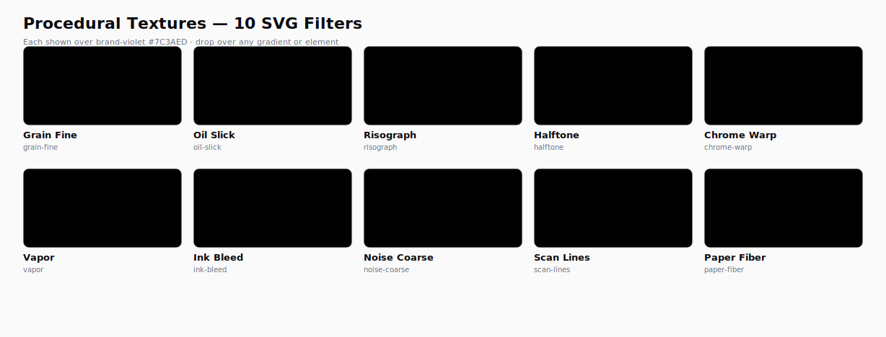

<!-- okaybabe gradient pack — README -->

<div align="center">

<picture>
  <source media="(prefers-color-scheme: dark)" srcset="docs/assets/banner-dark.svg">
  
</picture>

<br>

# okaybabe gradient pack

### 41 gradients · 10 procedural textures · 13 GLSL shaders. MIT. Use them anywhere.

<br>

[](LICENSE)
[](https://okaybabe.com/gradients)
[](https://www.figma.com/community/file/1644524450593985939/okaybabe-gradient-pack-v1-0-0)
[](https://discord.gg/uYZbByZSjr)

<br>

A free, MIT-licensed gradient + texture + shader pack from [the okaybabe studio](https://okaybabe.com). Drop them into Sketch, Figma, your CSS, your Tailwind config, your Three.js scene, or your next pitch deck.

<br>

[Aperture](#aperture-series--prismatic-anchor) · [Surface](#surface-series--paper-tones-library) · [Studio](#studio-series--palettes-from-the-field) · [Vapor](#vapor-series--soft-pastel) · [Ink](#ink-series--high-contrast-editorial) · [Procedural Textures](#procedural-textures--10-svg-filters) · [GLSL Shaders](#glsl-shaders--13-fragment-shaders) · [Formats](#download-formats)

</div>

<br>

---

## What's in the pack

<table>
<thead>
<tr><th align="left">Class</th><th align="left">Count</th><th align="left">What it is</th></tr>
</thead>
<tbody>
<tr>
<td><b>Gradients</b></td>
<td><code>41</code></td>
<td>Five named series (Aperture · Surface · Studio · Vapor · Ink), each tonally coherent. All okaybabe-original, hand-curated or extracted from owned content.</td>
</tr>
<tr>
<td><b>Procedural textures</b></td>
<td><code>10</code></td>
<td>SVG <code>feTurbulence</code> filter recipes. Layer over any gradient — or anything else.</td>
</tr>
<tr>
<td><b>GLSL shaders</b></td>
<td><code>13</code></td>
<td>Hand-authored animated fragment shaders. Pure GLSL <em>+</em> ready-to-import <code>react-three-fiber</code> components <em>+</em> MP4 previews color-graded in DaVinci Resolve.</td>
</tr>
<tr>
<td><b>Total</b></td>
<td><code>64</code></td>
<td>All okaybabe-original. All MIT. Free for personal AND commercial use, no attribution required.</td>
</tr>
</tbody>
</table>

<br>

---

## Aperture Series — Prismatic Anchor

6 hand-crafted prismatic gradients anchored to the okaybabe brand (`#7C3AED` violet-600 + indigo `#6366F1`). Hero series — the brand identity wash. From the full-spectrum **Refraction** to the deep regal **Crown** and the bright **Halo** lift.

<picture>
  <source media="(prefers-color-scheme: dark)" srcset="docs/assets/series-aperture-dark.svg">
  
</picture>

<br>

---

## Surface Series — Paper Tones Library

19 paper-tone gradients extracted from owned analog textures via OKLCH k-means clustering. Earth · Champagne · Paper · Textile · Cool tiers. Subtle by design — pair with the `grain-fine` or `paper-fiber` procedural filter for the okaybabe signature look.

<picture>
  <source media="(prefers-color-scheme: dark)" srcset="docs/assets/series-surface-dark.svg">
  
</picture>

<br>

---

## Studio Series — Palettes From the Field

6 gradients distilled from real okaybabe studio engagements — twilight palettes (**Dusk** / **Caravan** / **Outpost**), brand canon (**Mascot**), and original studio palettes (**Forge** / **Cohort**). Portfolio breadcrumbs that double as palettes.

<picture>
  <source media="(prefers-color-scheme: dark)" srcset="docs/assets/series-studio-dark.svg">
  
</picture>

<br>

---

## Vapor Series — Soft Pastel

5 soft-pastel originals: **Mist · Haze · Veil · Lull · Drift**. Trend coverage without chasing. Pair beautifully with `vapor` or `grain-fine` procedural texture for dreamy backdrops.

<picture>
  <source media="(prefers-color-scheme: dark)" srcset="docs/assets/series-vapor-dark.svg">
  
</picture>

<br>

---

## Ink Series — High-Contrast Editorial

5 high-contrast duo-tones with chromatic aberration: **Sumi · Reverb · Crash · Cipher · Strobe**. Editorial / pitch-deck character. Layer with `risograph` or `ink-bleed` procedural texture for the print-press finish.

<picture>
  <source media="(prefers-color-scheme: dark)" srcset="docs/assets/series-ink-dark.svg">
  
</picture>

<br>

---

## Procedural Textures — 10 SVG Filters

Drop any of these `<filter>` recipes over any gradient (or any element) for the okaybabe signature paper-grain, oil-slick, riso, or chromatic-aberration look. **Zero-byte, infinitely scalable, parametric.** Shown below over brand-violet for visual contrast.

<picture>
  <source media="(prefers-color-scheme: dark)" srcset="docs/assets/procedural-dark.svg">
  
</picture>

<br>

---

## GLSL Shaders — 13 Fragment Shaders

<sub>**Status:** SHIPPED. Hand-authored animated GLSL with `react-three-fiber` component wrappers and MP4 previews rendered via Remotion 4.x. Live preview MP4s at [previews.okaybabe.dev](https://previews.okaybabe.dev/v1/halation-1080p.mp4). Live React components install via `pnpm add @okaybabe/shaders`.</sub>

<table>
<tr>
<td><b><a href="https://previews.okaybabe.dev/v1/aperture-bloom-1080p.mp4">Aperture Bloom</a></b></td><td>5-blade polar symmetry — brand-canonical petals echoing the okaybabe aperture mark</td>
<td><b><a href="https://previews.okaybabe.dev/v1/halation-1080p.mp4">Halation</a></b></td><td>Subtle chromatic-aberration glow — the UI-grade primitive</td>
</tr>
<tr>
<td><b><a href="https://previews.okaybabe.dev/v1/quarry-1080p.mp4">Quarry</a></b></td><td>Slow flowing layered noise — stone-textured ambient field</td>
<td><b><a href="https://previews.okaybabe.dev/v1/ink-run-1080p.mp4">Ink Run</a></b></td><td>Wet ink soaking into warm paper, capillary tide-line</td>
</tr>
<tr>
<td><b><a href="https://previews.okaybabe.dev/v1/optic-1080p.mp4">Optic</a></b></td><td>Lens with 5-blade aperture symmetry, chromatic edge separation</td>
<td><b><a href="https://previews.okaybabe.dev/v1/foxglove-1080p.mp4">Foxglove</a></b></td><td>Soft floral chromatic bloom, 5-fold petals, throat stippling</td>
</tr>
<tr>
<td><b><a href="https://previews.okaybabe.dev/v1/prism-stop-1080p.mp4">Prism Stop</a></b></td><td>Central refractive band — prism dispersion across R/G/B channels</td>
<td><b><a href="https://previews.okaybabe.dev/v1/twilight-run-1080p.mp4">Twilight Run</a></b></td><td>Warm-top → deep-bottom horizon + horizontal streaks</td>
</tr>
<tr>
<td><b><a href="https://previews.okaybabe.dev/v1/vellum-1080p.mp4">Vellum</a></b></td><td>Warm parchment with paper grain + soft light drift</td>
<td><b><a href="https://previews.okaybabe.dev/v1/sirocco-1080p.mp4">Sirocco</a></b></td><td>Desert wind with horizontal streaks + dust drift</td>
</tr>
<tr>
<td><b><a href="https://previews.okaybabe.dev/v1/hessian-1080p.mp4">Hessian</a></b></td><td>Burlap weave with cross-hatched fiber + organic variance</td>
<td><b><a href="https://previews.okaybabe.dev/v1/chroma-bleed-1080p.mp4">Chroma Bleed</a></b></td><td>Discrete R/Y/G/C/B fringes around bright peaks — CRT-style spectral artifacts</td>
</tr>
<tr>
<td><b><a href="https://previews.okaybabe.dev/v1/membrane-1080p.mp4">Membrane</a></b></td><td>Cellular outlines on warm substrate — microscope-view tissue</td>
<td></td><td></td>
</tr>
</table>

Each shader ships in 4 video sizes (`-1080p.mp4` master, `-1080sq.mp4` social, `-720p.mp4` README, `-540sq.mp4` gallery) plus a `-poster.jpg` thumbnail. Browse the full URL pattern at `https://previews.okaybabe.dev/v1/<shader>-<variant>.<ext>`.

<br>

---

## Download Formats

<table>
<thead>
<tr><th align="left">Format</th><th align="left">What's in it</th><th align="left">Use it in</th></tr>
</thead>
<tbody>
<tr><td><b>Sketch</b></td><td>Shared Layer Styles per gradient</td><td>Sketch (drag in, double-click to install)</td></tr>
<tr><td><b>Figma Community</b></td><td>Fill Styles per gradient</td><td>Figma (duplicate to your team)</td></tr>
<tr><td><b>CSS</b></td><td><code>.gradient-{slug}</code> classes</td><td>Any project. Drop in <code>&lt;head&gt;</code>.</td></tr>
<tr><td><b>SCSS</b></td><td><code>$gradient-{slug}</code> variables + mixins</td><td>Sass projects</td></tr>
<tr><td><b>JSON</b></td><td>Unified schema</td><td>Any pipeline / custom tooling</td></tr>
<tr><td><b>Tailwind v4</b></td><td><code>@theme</code> block with custom utilities</td><td>Tailwind 4 projects</td></tr>
<tr><td><b>Shaders ZIP</b></td><td>GLSL source + R3F wrappers + MP4 previews</td><td>Three.js / R3F / Unity / any GLSL-aware tool</td></tr>
</tbody>
</table>

<br>

---

## Local dev

```bash
nvm use            # Node 24
pnpm install
pnpm extract:dry   # smoke-test color extraction on owned source textures
pnpm extract       # full extraction → data/okaybabe-custom-candidates.json
pnpm build:readme  # regenerate all showcase SVGs from current data
pnpm build:packs   # generate all download formats → dist/downloads/
```

<br>

---

## How we built it

- **Color extraction** — saliency-weighted k-means in **OKLCH** space (perceptually uniform). Pre-blur via `sharp.blur(1.0)` to kill JPEG compression artifacts. `seed=42` deterministic. Provenance recorded per gradient.
- **Hand-craft + algorithm hybrid** — Aperture + Studio + Vapor + Ink series authored from brand canon + real studio palettes; Surface series extracted from owned analog textures. Every gradient is okaybabe-original.
- **Procedural textures** — JSON recipes, not pre-rendered PNGs. Per-format adapters emit native equivalents (Sketch noise effect / Figma effect layer / CSS inline SVG data-URI).
- **Shader authoring** — hand-crafted GLSL. MP4 previews captured headless via Puppeteer + ffmpeg, then color-graded in DaVinci Resolve for the cinematic finish.
- **Determinism** — sorted JSON keys, hardcoded `createdAt`, hash-snapshot CI tests. Same input → same output, every time.

<br>

---

## License posture

- **Source code:** MIT (this repo + every emitted pack file header)
- **Generated gradients + textures + shaders:** MIT — full free use, including commercial, with no attribution required
- **Provenance:** every gradient records its source for audit-trail integrity. For the Surface Series, source pixels are never redistributed — only extracted color values, which aren't copyrightable.

<br>

---

## Built by

<table>
<tr>
<td valign="middle" align="center">

</td>
<td valign="middle">

### [the okaybabe studio](https://okaybabe.com)

<sub>the design studio that ships end-to-end.</sub>

We design, build, host, and rank a small number of custom sites a year. This pack is part of how we share back. Free, MIT, no attribution required — use it anywhere, including in things you ship to your customers.

[**okaybabe.com**](https://okaybabe.com) · [**Discord**](https://discord.gg/uYZbByZSjr) · [**Companion: @okaybabe/shaders**](https://github.com/Okay-Babe/okaybabe-shaders)

</td>
</tr>
</table>

<br>

<div align="center">

[](https://okaybabe.com)
[](https://discord.gg/uYZbByZSjr)
[](mailto:hello@okaybabe.com)

<br>

<sub>© okaybabe™ · 2026 · MIT licensed · Free forever</sub>

</div>
